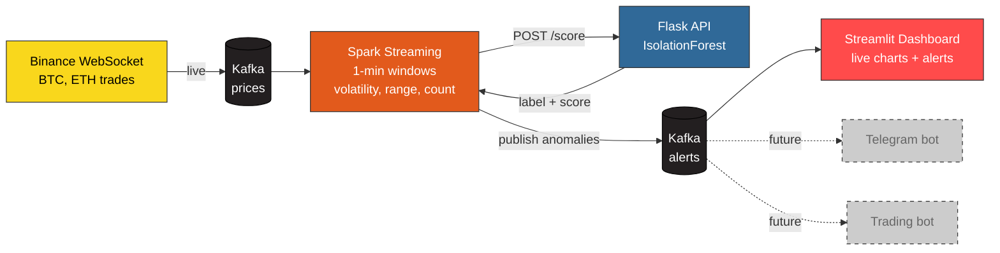

# CryptoMonitor — Real-Time Anomaly Detection for Crypto Markets

> Course project for **Real-Time Analytics (222891-D)** — SGH Warsaw School of Economics, Spring 2025/2026.


## The Problem

In cryptocurrency markets, **60 seconds is the difference between catching a flash crash and being its victim.**

Existing retail tools alert on absolute price thresholds — *"notify me when BTC drops 5%"* — but by the time that alert fires, the move is already over. What traders actually need is **early warning**: a signal that something abnormal is starting **before** the obvious price move. That signal lives in **volatility** — how chaotic prices become in short time windows. Computing it in real time across thousands of trades per second requires streaming infrastructure that is out of reach for individuals.

## The Solution

CryptoMonitor is a real-time pipeline that ingests every BTC/USDT and ETH/USDT trade from Binance, computes statistical features over 1-minute windows, and uses a machine learning model to flag windows that are statistically abnormal. Anomalies are published to a Kafka topic where any downstream system — a dashboard, a trading bot, a Telegram alert — can subscribe.

## Proof It Works

A 13-minute monitoring session captured:

| Metric | Value |
|---|---|
| Trades processed | 76,506 |
| Windows analyzed | 26 |
| Anomalies flagged | 20 (1.5 / minute) |
| Most extreme BTC event | $113 swing in 60s across 6,718 trades |
| Most extreme ETH event | volatility 3× baseline (1.23 vs ~0.4) |

See `screenshots/` for dashboard captures.

---

## Architecture



**Why this design.** Spark handles streaming and time-window logic; the ML model lives behind a Flask API so it can be retrained or replaced without touching the Spark job. The two services are decoupled by HTTP, and alerts are decoupled by Kafka — so any number of downstream consumers can subscribe (dashed boxes = future extensions).

## Components

| File | Purpose | Stack |
|---|---|---|
| `producer.py` | Streams live trades from Binance WebSocket into Kafka `prices` topic | kafka-python, websocket-client |
| `data_collector.py` | Aggregates historical prices into 1-min windows → `training_data.csv` | kafka-python, pandas |
| `train_model.ipynb` | Trains one IsolationForest per symbol → `model.pkl` | scikit-learn, joblib |
| `app.py` | Flask REST API: `/score`, `/health`, `/stats` (loads `model.pkl` once at startup) | Flask, joblib |
| `spark_processor.ipynb` | Reads `prices` stream, computes windowed stats, calls Flask `/score`, publishes anomalies | PySpark Structured Streaming, requests |
| `dashboard.py` | Live charts (Plotly) + anomaly table, auto-refresh every 5s | Streamlit |

## Quick Start

### Prerequisites
- Docker Desktop with Kafka + JupyterLab (`compose.yaml` in `../jupyterlab-project/`)
- Python 3.10+ on the host
- Free ports: `8999` JupyterLab · `5000` Flask · `8501` Streamlit · `29092` Kafka

### Run order (each in its own terminal)

```bash
# 1. Start infrastructure
cd ../jupyterlab-project && docker compose up -d

# 2. Producer (on host)
cd RTA_DT/project
pip install -r requirements.txt
python producer.py

# 3. Flask API (in JupyterLab terminal)
cd /home/jovyan/notebooks/crypto-project
python app.py

# 4. Streamlit dashboard (in JupyterLab terminal)
python -m streamlit run dashboard.py --server.port 8501 --server.address 0.0.0.0
```

Then in JupyterLab, open `spark_processor.ipynb` → Run All Cells.

Open `http://localhost:8501` in a browser to see the dashboard.

### One-time setup

After the producer has run for ~30 minutes, collect training data and train the model:

```bash
python data_collector.py   # → training_data.csv
jupyter nbconvert --execute train_model.ipynb   # → model.pkl
```

## API Reference

### `POST /score`

```json
// Request
{ "symbol": "BTCUSDT", "volatility": 25.0, "price_range": 100.0, "trades": 2800 }

// Response
{
  "symbol": "BTCUSDT",
  "label": "NORMAL",
  "anomaly_score": 0.0483,
  "features_used": { "volatility": 25.0, "price_range": 100.0, "trades": 2800 }
}
```

`label` ∈ `{NORMAL, ANOMALY, UNKNOWN_SYMBOL}` · `anomaly_score`: positive = normal, negative = anomaly.

### `GET /health`
Liveness check. Returns loaded model symbols.

### `GET /stats`
Counters: total requests, anomalies, normals.

## ML Model

- **Algorithm:** Isolation Forest — unsupervised, no labels required, robust to outliers
- **One model per symbol** — BTC (~$67k) and ETH (~$1.9k) live on different scales; a shared model would be dominated by BTC
- **Features:** `volatility` (stddev of price), `price_range` (max − min), `trades` (count)
- **Hyperparameters:** `contamination=0.1`, `n_estimators=100`, `random_state=42`
- **Training data:** ~25 windows per symbol, collected from Kafka

## Trade-offs & Future Work

| Decision | Trade-off |
|---|---|
| In-memory ML inference via HTTP | Adds ~10ms latency per window. Fine for 1-min windows; not for sub-second use cases. |
| IsolationForest with 25 windows | Quick to train, but not very statistically powerful. More history would let us use seasonality features. |
| Kafka in KRaft mode without persistence volume | Data is lost on `docker compose down`. Fine for demos, not for production. |
| Streamlit dashboard | Single-user, polls Kafka every 5s. A production version would push updates via WebSocket. |

**Next steps:** add more symbols, integrate Twitter sentiment as a second signal, wire alerts to a Telegram bot for instant notification, persist alerts to a time-series DB (TimescaleDB).

## Tech Stack

Apache Kafka 7.8 (KRaft) · Apache Spark 3.5+ Structured Streaming · scikit-learn · Flask 3 · Streamlit · Plotly · Docker Compose · Python 3.11

## Author

**Đạt Thái** — Real-Time Analytics, SGH WSE Spring 2025/2026
